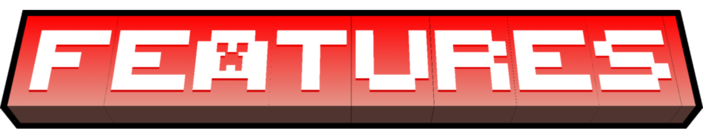

<div align="center">
  

  <br>

  <a href="https://github.com/lunarenzo/killcash/releases">
    
  </a>
  
  
  
  
  <a href="LICENSE">
    
  </a>
</div>

---

KillCash is a high-performance Paper/Spigot Minecraft plugin designed to reward players with custom economy cash when they defeat other players in PVP combat. Built on a modern multi-module architecture, it is designed for speed, flexibility, and extensibility, offering database synchronization for multi-server networks and a robust developer API.

---

## ⚙️ Compatibility & Requirements

* **Supported Platforms:** 
  * **Paper**, **Purpur**, and **Folia** (fully supported with multi-threaded compatibility).
  * *Note: Spigot is not natively supported due to the plugin's direct dependency on Paper's native Adventure Component API (MiniMessage) for formatting and performance.*
* **Supported Game Versions:** Minecraft **1.20 - 1.21.x+** (compiled against Paper API `1.21.11`).
* **Java Version:** **Java 21** or higher (compiled using JDK 21 toolchain).

---

## 🌟 Key Features



* **PVP Cash Rewards:** Configurable minimum and maximum payout ranges. Includes a `wholeNumberOnly` option to keep base rewards and calculated multipliers rounded mathematically.
* **Cash Multipliers:**
  * **Permission-based:** Grant custom multipliers based on permissions (e.g. for VIP/MVP ranks).
  * **Streak-based:** Compounding multipliers applied automatically as players build up killstreaks.
* **Anti-Abuse Protection:** Built-in safeguards to prevent cash farming, including IP-matching checks, customizable kill cooldowns between the same players, and minimum playtime requirements for victims.
* **Decoupled & Clean Configurations:** Modular file separation to prevent configuration clutter:
  * `config.yml` - Core storage, update checker, language, and Vault conversion settings.
  * `pvp-rewards.yml` - Base cash rewards, multipliers, anti-abuse, and killstreak announcements/sounds.
  * `death-effects.yml` - Client-side packet-based lightning and sound feedback.
  * `death-messages.yml` - Custom death formats, weapon icons, and mob-specific formats.
  * *Includes an automatic `ConfigMigrator` that seamlessly splits and transfers legacy single-file configurations on upgrade.*
* **Rich Death Announcements:** Fully customizable messages for PVP, unarmed fists, mob-specific deaths, and natural causes (lava, gravity, drowning) styled using MiniMessage. Supports custom weapon icons and hoverable weapon/item tooltips.
* **Zero-Lag Visuals & Sound:** Client-side packet-based lightning and sound effects. Configure whether feedback is private (killer and victim only) or broadcast to all players within a custom radius.
* **Vault Integration & Conversion:** Allows players to convert their KillCash tokens into main server money (Vault/EssentialsX) via `/killcash convert <amount>` with configurable exchange rates.
* **Flexible Storage Backends:**
  * **PDC (PersistentDataContainer):** Local, zero-setup storage using vanilla player NBT files. Ideal for single-server setups.
  * **DATABASE:** High-performance database caching supporting SQLite, MySQL, MariaDB, PostgreSQL, and H2. Powered by Flyway migrations, HikariCP connection pooling, and jOOQ query building.
* **Network Syncing:** Real-time multi-server cross-syncing via Redis and RabbitMQ messaging brokers.
* **Resilient Third-Party Integrations:**
  * **PlaceholderAPI (PAPI):** Fully supported across all messages, using context-aware parsing to prevent NullPointerExceptions.
  * **PvPManager:** Resolves combat logout deaths to reward the last active attacker with the kill credit and killstreak shutdown bonuses instead of logging it as a suicide.

---

## 💻 Commands & Permissions

All commands support the `/killcash` base command, along with the `/kc` shorthand alias.

| Command | Aliases | Description | Permission Node | Default |
| :--- | :--- | :--- | :--- | :--- |
| `/killcash help` | | Shows help menu and commands list. | `killcash.command` | Operators |
| `/killcash balance [player]` | `/kc bal` | View current cash balance. | `killcash.command.balance` | Everyone |
| `/killcash stats [player]` | | View stats (kills, deaths, balance, streak). | `killcash.command.stats` | Everyone |
| `/killcash pay <player> <amount>` | | Send cash directly to another player. | `killcash.command.pay` | Everyone |
| `/killcash convert <amount>` | `/kc exchange` | Convert tokens to main server currency. | `killcash.command.convert` | Everyone |
| `/killcash baltop` | `/kc balancetop` | View top 10 players with the highest balance. | `killcash.command.baltop` | Everyone |
| `/killcash give <player/*> <amount>` | | Add cash to a player's balance. | `killcash.command.give` | Operators |
| `/killcash take <player/*> <amount>` | | Deduct cash from a player's balance. | `killcash.command.take` | Operators |
| `/killcash reload [config/lang/all]` | | Reload configurations or language resources on-the-fly. | `killcash.command.reload` | Operators |
| `/killcash reloadconfig` | | Reload configuration files only. | `killcash.command.reload` | Operators |
| `/killcash reloadlang` | | Reload language translations only. | `killcash.command.reload` | Operators |
| `/killcash reloadall` | | Reload all files and systems. | `killcash.command.reload` | Operators |

---

## 🛠️ Developer API

KillCash provides a clean API module for developers. You can import the API via Maven or Gradle to query balances, listen to transaction events, or modify player cache.

### Gradle (Kotlin DSL)
```kotlin
repositories {
    mavenCentral()
}

dependencies {
    compileOnly("com.lunatech:killcash-api:1.2.2")
}
```

### Maven
```xml
<dependency>
    <groupId>com.lunatech</groupId>
    <artifactId>killcash-api</artifactId>
    <version>1.2.2</version>
    <scope>provided</scope>
</dependency>
```

---

## 🔧 Building from Source

Ensure you have Java 21 or higher installed. Clone the repository and run:
```bash
./gradlew build
```
Jars will be built and output to:
* `paper/build/libs/KillCash-paper-1.2.2.jar`
* `api/build/libs/KillCash-api-1.2.2.jar`
